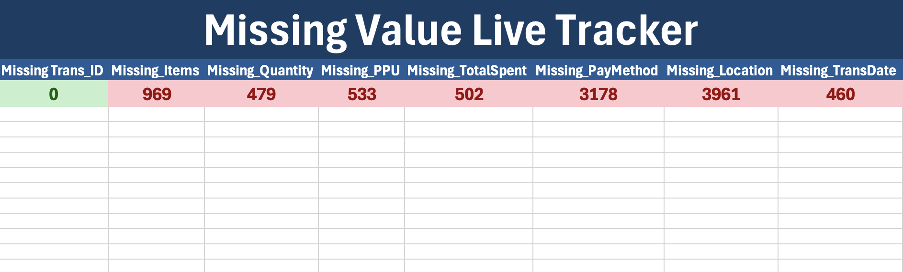
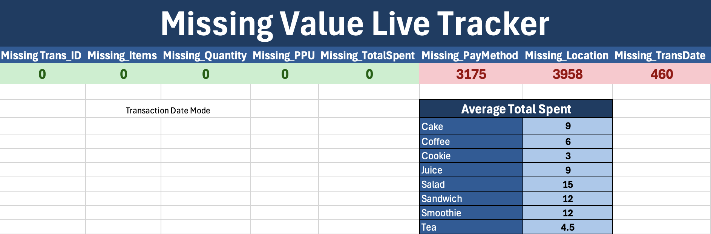
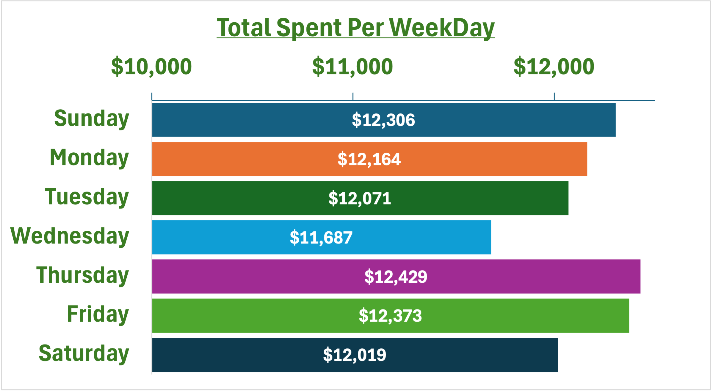
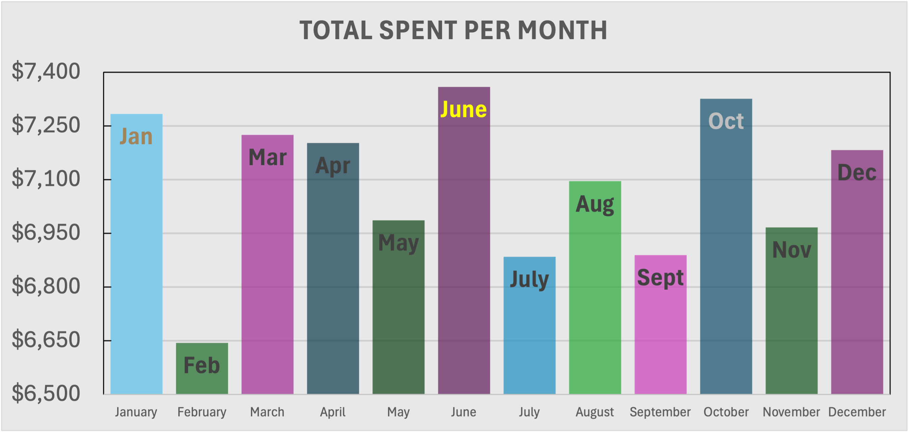
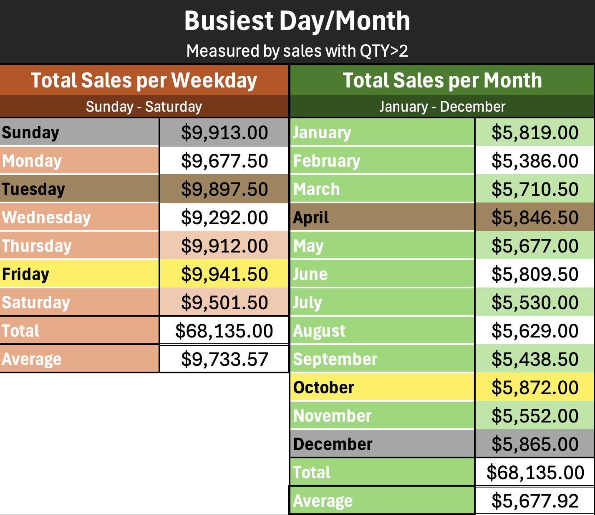
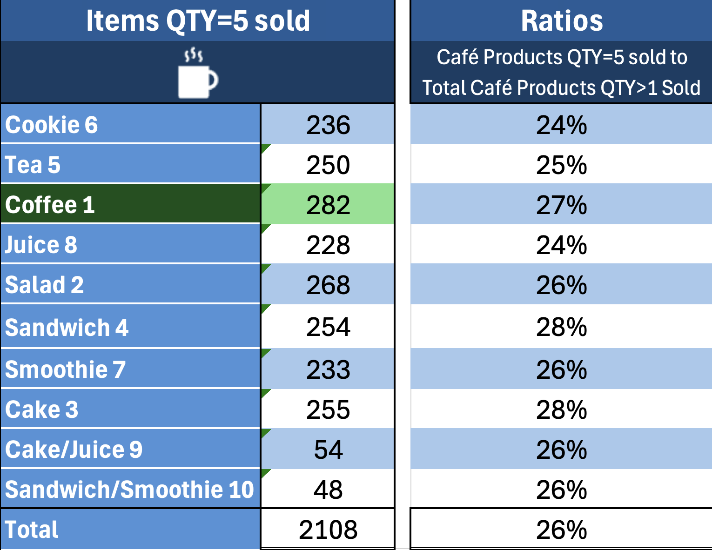
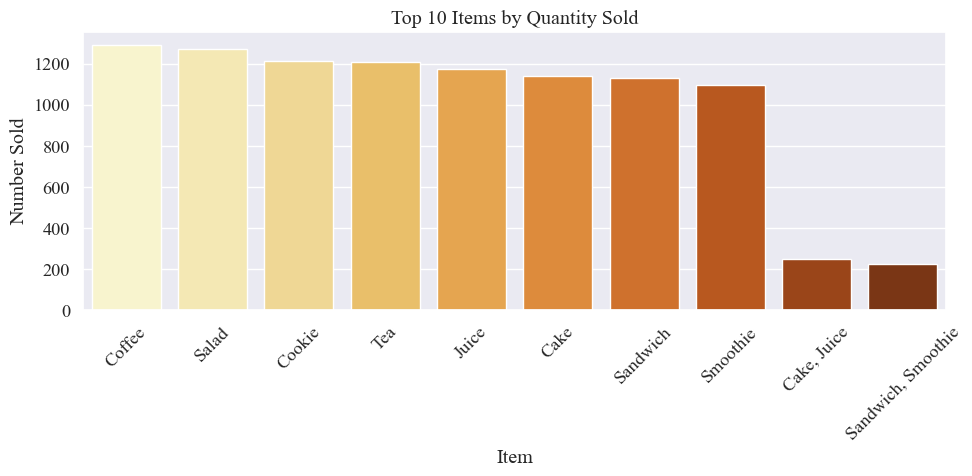

# Café Le Marcy Financial Analysis & Insights


**Work Done by:**

- Rolando (Ro) Mancilla-Rojas
- Thomas Segal
- Adebola (Debo) Odutola

## Project Overview

<p align="center">
Our team was hired by the owner of the popular café chain, Café Le Marcy, to clean and perform exploratory analysis on their transaction data for the year 2023. With hopes of providing sound advice on new marketing initiatives, our goals were to identify peak sales periods and general sales trends, and ensure the reliability of the datasets to provide key, actionable insights. In cleaning and analyzing the data, our team was able to pull impactful information that could greatly benefit Café Le Marcy.
</p>

### Aims
- Data Cleaning & Maintaining Reliability
- Peak Sales Months/Weekdays
- Weekday vs. Weekend sales; which is greater?
- Deep Dive into Transactions with Quantity (QTY) > 1

## Data Cleaning Summary

### Excel
- Cleaning done by Ro

<p align="center">
To make the cleaning process easier, I first created a live Missing Value Tracker. I used COUNTBLANK functions for every column to count missing cells, and used conditional formatting to display green if there are no blanks, or red if there are blanks.
</p>



<p align="center">
Once I had a live tracker, I began cleaning the data.
</p> 

***
Key actions include: 

- converting all UNKNOWN and ERROR rows to blanks.
- Filling in empty rows for Item, Quantity, Price Per Unit, and Total Spent through mathematical functions.
- Filling in 20 missing rows for the Total Spent column using the average value of Total Spent per each Item, which allows me to fill in Quantity.
- Dropping 5 rows due to missing Item and Price Per Unit values.

***

<p align="center">
This allowed me to clear up much of the missing rows, leaving only Transaction Date, Location, and Payment Method to deal with.
</p>



<p align="center">
A full list of cleaning steps are detailed below
</p>
  
1. Convert ERROR and UNKNOWN entries for all rows to blanks by filtering each column and replacing them with " ".									
2. Filtered Items Column to blank, filtered PPU Column to $1, $1.5, $2, & $5 respectively and filled filtered rows with IF functions to match items with PPU.									
3. Filtered PPU Column to blank, Filtered Items Column to each item to fill filtered rows with IF functions to match PPU with items.									
4. Filtered QTY Column and PPU Column to remove blanks, changed Total Spent Row to functions for those filtered rows.									
5. Filtered Total Spent Column and QTY Column to remove blanks, Filtered PPU Column to blanks, changed to functions for those filtered rows. --> prevents function overlap.									
6. Filtered Total Spent Column and PPU Column to remove blanks, Filtered QTY Column to blanks, changed to functions for those filtered rows. --> prevents function overlap.									
7. Dropped rows 1763, 2291, 3781, 4154, 7599 due to no Item name, PPU.									
8. Filled the 20 missing rows for Total Spent with Average Total Spent, for each matching Item, marked with orange									
9. Filled Transaction Date, Location, and Payment Method Columns with UNKNOWN using search and filter for filtered range

***

### Python
- Cleaning done by Debo

To begin cleaning the data, more information regarding the dataset must be obtained. After loading the CSV file using the Pandas library, a `.info` function was used to give an initial overview of the data.

Output:
```c++
RangeIndex: 10000 entries, 0 to 9999
Data columns (total 8 columns):
 #   Column            Non-Null Count  Dtype 
---  ------            --------------  ----- 
 0   Transaction ID    10000 non-null  object
 1   Item              9667 non-null   object
 2   Quantity          9862 non-null   object
 3   Price Per Unit    9821 non-null   object
 4   Total Spent       9827 non-null   object
 5   Payment Method    7421 non-null   object
 6   Location          6735 non-null   object
 7   Transaction Date  9841 non-null   object
dtypes: object(8)
memory usage: 625.1+ KB
```

<p align="center">
Just from visual analysis, we can see that every column besides Transaction ID had missing values.
</p>

 <p align="center">
To begin filling in missing values, variables were created to be used in equations to solve for missing rows.
 </p>

 ```c++
# Step 1: Calculate Differences
tIDdiff = cafeData["Transaction ID"].count()
idiff = cafeData["Item"].count()
qdiff= cafeData["Quantity"].count()
ppudiff = cafeData["Price Per Unit"].count()
tsdiff = cafeData["Total Spent"].count()
PMdiff = cafeData["Payment Method"].count()
ldiff = cafeData["Location"].count()
TDdiff = cafeData["Transaction Date"].count()
diff1= 10000 - tIDdiff
diff2 = 10000 - idiff
diff3 = 10000 - qdiff
diff4 = 10000 - ppudiff
diff5 = 10000 - tsdiff
diff6 = 10000 - PMdiff
diff7 = 10000 - ldiff
diff8 = 10000 - TDdiff
print(f'Missing values for each column \n Transaction ID: {diff1}  \n Item: {diff2} \n Quantity: {diff3} \n Price Per Unit: {diff4} \n Total Spent: {diff5} \n Payment Method: {diff6} \n Location: {diff7} \n Transaction Date: {diff8}')
```

<p align="center">
Next, converting rows and transforming the types of columns was needed in order to have a cleaner, organized dataset. To do this, functions were used to replace UNKNOWN and ERROR rows with blanks. 
</p> 

```c++
# Replace Quantity Missing Values
cafeData['Quantity'] = cafeData['Quantity'].replace('UNKNOWN', np.nan)
cafeData['Quantity'] = cafeData['Quantity'].replace("ERROR", np.nan)
cafeData['Quantity'] = cafeData['Quantity'].fillna(np.nan)

# Replace PPU Missing Values
cafeData[['Price Per Unit','Total Spent' ]] = cafeData[['Price Per Unit','Total Spent' ]].replace('UNKNOWN', np.nan)
cafeData[['Price Per Unit','Total Spent' ]] = cafeData[['Price Per Unit','Total Spent' ]].replace("ERROR", np.nan)
cafeData[['Price Per Unit','Total Spent' ]] = cafeData[['Price Per Unit','Total Spent' ]].fillna(np.nan)

# Replace Transaction Date Missing Values
cafeData['Transaction Date'] = cafeData['Transaction Date'].replace(['UNKNOWN', 'ERROR'], pd.NA)
cafeData['Valid Date'] = cafeData['Transaction Date'].notna()
cafeData['Transaction Date'] = pd.to_datetime(cafeData['Transaction Date'], errors='coerce')

# Replace Item Missing Values
cafeData['Item'] = cafeData['Item'].replace('UNKNOWN', "No Data")
cafeData['Item'] = cafeData['Item'].replace("ERROR", "No Data")
cafeData['Item'] = cafeData['Item'].replace("nan", "No Data")
cafeData['Item'] = cafeData['Item'].fillna("No Data")

cafeData[['Transaction ID','Item','Payment Method','Location']] = cafeData[['Transaction ID','Item','Payment Method','Location']].astype(str)
cafeData['Quantity'] = cafeData['Quantity'].astype(float)
cafeData[['Price Per Unit','Total Spent' ]] = cafeData[['Price Per Unit','Total Spent' ]].astype(float)
cafeData['Transaction Date'] = pd.to_datetime(cafeData['Transaction Date'])
cafeData.info()
```

All that was left to do after this was to use `IF` statements and `.loc` functions to fill in the remaining blank rows that could be filled in logically. The `IF` statements were used to sift through all the rows and fill them in using mathematical equations, given that there was data in the rows needed to solve them. Furthermore, `.loc` functions were used to define certain Prices per Unit (PPU) with their respective items, given that the item only had one possible PPU.

```c++
# Use PPU, Quantity, and Total Spent to calculate each other
for index, row in cafeData.iterrows():
    qty = row['Quantity']
    ppu = row['Price Per Unit']
    total = row['Total Spent']
    

    if (pd.isna(total) or total == 0) and qty > 0 and ppu > 0:
        cafeData.at[index, 'Total Spent'] = qty * ppu
    

    elif (pd.isna(ppu) or ppu == 0) and qty > 0 and total > 0:
        cafeData.at[index, 'Price Per Unit'] = total / qty


    elif (pd.isna(qty) or qty == 0) and ppu > 0 and total > 0:
        cafeData.at[index, 'Quantity'] = total / ppu

# Defines Item by PPU
cafeData.loc[cafeData['Price Per Unit'] == 1, 'Item'] = 'Cookie'
cafeData.loc[cafeData['Price Per Unit'] == 1.5, 'Item'] = 'Tea'
cafeData.loc[cafeData['Price Per Unit'] == 2, 'Item'] = 'Coffee'
cafeData.loc[(cafeData['Item'] == 'No Data') & (cafeData['Price Per Unit'] == 3.0), 'Item'] = 'Cake, Juice'
cafeData.loc[(cafeData['Item'] == 'No Data') & (cafeData['Price Per Unit'] == 4.0), 'Item'] = 'Sandwich, Smoothie'
cafeData.loc[cafeData['Price Per Unit'] == 5, 'Item'] = 'Salad'

#Defines PPU by Item

cafeData.loc[cafeData['Item'] == 'Cookie', 'Price Per Unit'] = 1
cafeData.loc[cafeData['Item'] == 'Tea', 'Price Per Unit'] = 1.5
cafeData.loc[cafeData['Item'] == 'Coffee', 'Price Per Unit'] = 2
cafeData.loc[cafeData['Item'] == 'Cake', 'Price Per Unit'] = 3
cafeData.loc[cafeData['Item'] == 'Juice', 'Price Per Unit'] = 3
cafeData.loc[cafeData['Item'] == 'Sandwich', 'Price Per Unit'] = 4
cafeData.loc[cafeData['Item'] == 'Smoothie', 'Price Per Unit'] = 4
cafeData.loc[cafeData['Item'] == 'Salad', 'Price Per Unit'] = 5

# Use PPU, Quantity, and Total Spent to calculate each other
for index, row in cafeData.iterrows():
    qty = row['Quantity']
    ppu = row['Price Per Unit']
    total = row['Total Spent']
    

    if (pd.isna(total) or total == 0) and qty > 0 and ppu > 0:
        cafeData.at[index, 'Total Spent'] = qty * ppu
    

    elif (pd.isna(ppu) or ppu == 0) and qty > 0 and total > 0:
        cafeData.at[index, 'Price Per Unit'] = total / qty


    elif (pd.isna(qty) or qty == 0) and ppu > 0 and total > 0:
        cafeData.at[index, 'Quantity'] = total / ppu
```

<p align="center">
This ensured the data was as clean as possible, using all possible logical mathematical equations used to fill in missing rows.
</p>

## Key Findings

### Excel
- Analysis done by Ro

<p align="center">
In analyzing the cleaned dataset, there were many key insights I pulled. The main factors in question—busiest and most profitable day and month—were determined in varying methods. To begin exploring these questions, however, the dataset required the creation of new columns to determine the month and day of the week of the Transaction Dates.
</p> 

<p align="center">
I used MONTH and WEEKDAY functions within an IFERROR function to extract the month and day of the week from the Transaction Date column. Furthermore, I used a CHOOSE function to label the output of MONTH and WEEKDAY by their appropriate text month, rather than a numeric value. This was mainly done to make the charts more appealing.
</p>

***

<p align="center">
 Next, to determine the most profitable day and month, I used PivotTables to produce charts that showed the Total Spent for each weekday and month.
</p>



<p align="center">
As shown, Thursday, Friday, and Sunday were the most profitable days of the week when accounting for all total sales.
</p>

***



<p align="center">
This chart shows the Monthly Total Sales, with June, October, and January being the most profitable months.
</p>

***

<p align="center">
The next factor in question—busiest day and month—was calculated by measuring transactions where quantity was greater than 2. This assumption was made because orders with higher quantities take longer to prepare, likely resulting in higher wait times and busier hours.
</p>



<p align="center">
As shown, we can see that Friday, Sunday, and Tuesday are the busiest days, shown in order by the colors gold, silver, and bronze. For months, October, December, and April are the busiest months, similarly in color.
</p>

***

<p align="center">
Other analyses included a plethora of key insights, including counts of cafe products sold, payment methods, and quantities of products sold per transaction. However, one insight I was particularly drawn to was transactions where quantity was greater than 1.
</p>

<p align="center">
I calculated cafe products sold where quantity, or QTY, was over 1 by using a COUNTIFS function, which determined each type of cafe product sold where QTY > 1. When calculated, the order of products sold from most to least was:
</p>

1. Coffee
2. Salad
3. Tea
4. Cookie
5. Juice
6. Cake
7. Sandwich
8. Smoothie

<p align="center">
When I did summary statistics on this filtered dataset, however, I found that the most repeated value for QTY was 5. This surprised me, so I decided to dig deeper. I used the same COUNTIFS function, but instead I found products where QTY = 5.
</p>

***


<p align="center">
As shown, the rankings of most of the sold products changed when QTY = 5. The new order entailed:
</p>

1. Coffee
2. Salad
3. Cake
4. Sandwich
5. Tea
6. Cookie
7. Smoothie
8. Juice

<p align="center">
Furthermore, the ratio of QTY = 5 to QTY > 1 shows that transactions where QTY = 5 accounted for 26% of all transactions where QTY > 1.
</p>

<p align="center">
This is a significant portion—over a quarter of the filtered dataset—that consisted of many products sold in one transaction.
</p>

***

### Python
- Analysis done by Debo

After importing the cleaned CSV into a new notebook, functions such as `.crosstab`, `.value_counts`, and `.isin` were among the top functions used to view the dataset in various filtered methods. Not only did this help bring a deeper understanding of the dataset, this also set up variables that could be used to visualize later.

<p align="center">
Some key code lines include:
</p>

```c++
# Table looking at quantity purchased vs Item
pd.crosstab(cafeData["Quantity"], cafeData['Item'])

# Total revenue
total_revenue = cafeData['Total Spent'].sum()

# Average spend per transaction
average_spend = cafeData['Total Spent'].mean()

# Total quantity sold
total_quantity = cafeData['Quantity'].sum()

# Top 5 items sold
top_items = cafeData['Item'].value_counts().head(5)

print("Total Revenue:", total_revenue)
print("Average Spend per Transaction:", average_spend)
print("Total Quantity Sold:", total_quantity)
print("Top 5 Most Sold Items:\n", top_items)
```

```c++
item_quantity = cafeData.groupby('Item')['Quantity'].sum().sort_values(ascending=False)
item_revenue = cafeData.groupby('Item')['Total Spent'].sum().sort_values(ascending=False)

print("Total Quantity Sold by Item:\n", item_quantity.head(10))
print("\nTotal Revenue by Item:\n", item_revenue.head(10))
```

<p align="center">
Using these methods, many of the analyses done in Excel aligned with the conclusions pulled using Python notebooks. However, effective visualizations could still be used to display slight differences found, mainly due to differences in the approach to cleaning the dataset between Ro and Debo. This was done intentionally to see if these differences accounted for a large margin of error.
</p>

***

<p align="center">
Next, the sns and plt libraries were used to produce effective visuals concerning the data. A key visual insight created using these libraries included the Top 10 Items sold, sorted in descending order:
</p>



<p align="center">
As shown, Coffee, Salad, and Cookies were the top 3 selling items at Café Le Marcy.
</p> 

***

The Codeblock used to produce the chart:
```c++
top_items = cafeData['Item'].value_counts().head(10).reset_index()
top_items.columns = ['Item', 'Count']

plt.figure(figsize=(10, 5))
sns.set_theme(font="Times New Roman", font_scale=1.2)
sns.barplot(data=top_items, x='Item', y='Count', hue='Item', palette='YlOrBr', legend=False)
plt.title("Top 10 Items by Quantity Sold")
plt.ylabel("Number Sold")
plt.xticks(rotation=45)
plt.tight_layout()
plt.show()
```

## Takeaways & Recommendations
<p align="center">
There were many key insights pulled from the data.
</p>

For starters, there seemed to be a big issue regarding the data collection, particularly with the Payment Method and Transaction Location columns. Our team recommends looking into into why there seems to be many errors when collecting this information.

<p align="center">
In regards to our original aims, we found a consistent answer for the busiest and most profitable days and months for the business. 
</p> 

For the most profitable days and months, the total revenue for these specific dates showed that **Thursday**, **Friday**, and **Sunday** were the highest-earning days, respectively, while **June**, **October**, and **January** were, in ranked order, the highest-earning months.

For the busiest days in the month and day, we made the assumption that Transactions where the Quantity was greater than 1 would be attributed to busier days, as it would take longer to produce these items. Therefore, we found that **October**, **December**, and **April** were the busiest months, in order. We also found that **Friday**, **Sunday**, and **Tuesday** were the busiest days, respectively.

It is interesting to note that the most profitable days and months didn't fully align with the busiest days and months, likely due to the types of items sold and their varying prices. However, the days certainly aligned with our fortified conclusion that **weekdays are busier than weekends.**

***

Lastly, our aim to dive deep into transactions with quantities over 1 yielded surprising results. We recommend that, since transactions with quantities of 5 accounted for just over 25% of the transactions with quantities greater than 1, that there should be an emphasis placed in creating an efficent system of outputing high quantity orders. This alone could decrease work costs, produce higher day-to-day profits, and increase ratings.

<p align="center">
However, if this is too much, we simply recommend creating deals that encourage less quantities, as to maintain a better workflow. One possible deal could be pairing sandwiches with smoothies, as they are both low-selling items and could potentially boost the bottom line.
</p> 

## Reflections

<p align="center">
As we worked with this dataset, we ran into many problems that were great points of learning. Some of the biggest issues we ran into were communicating, particularly within GitHub. I believe we could've prepared stronger slides, and thus, a stronger presentation, had we communicated and prepared accordingly.
</p>

<p align="center">
Overall, however, this experience was one we all thoroughly enjoyed. We hope to work again, stronger and more impactful having learned these lessons.


> [!NOTE]
>  This is a fictitious scenario created by the GitHub authors for academic purposes only.
